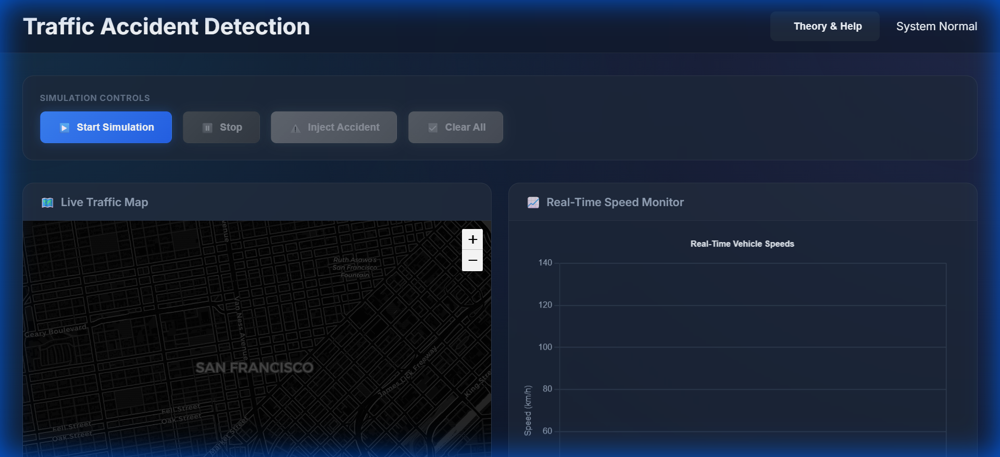
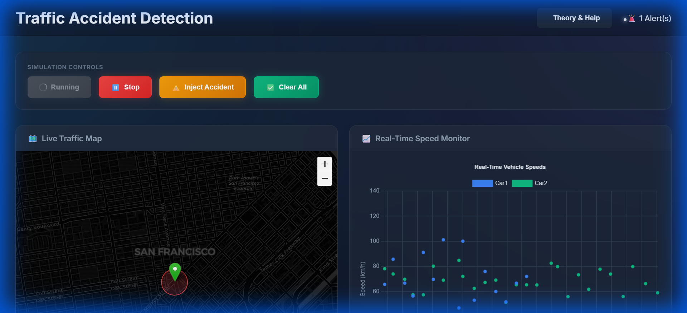
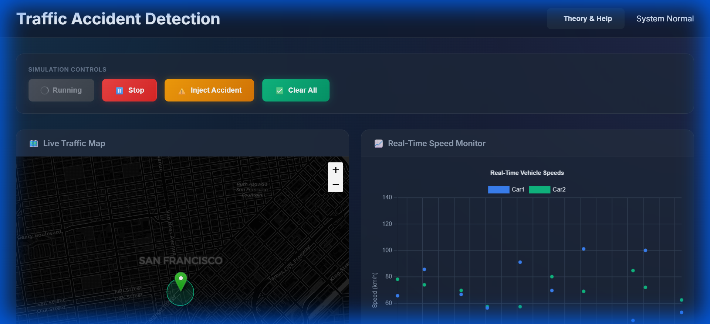
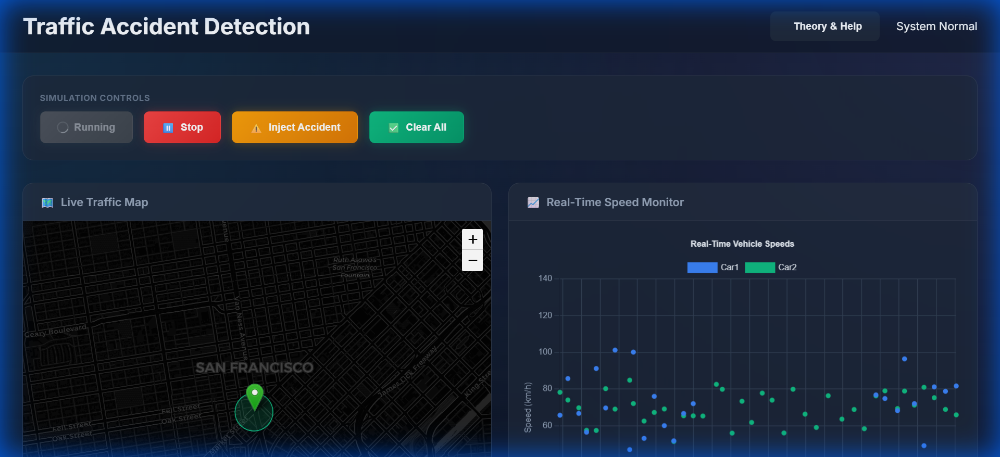

# 🚦 Real-Time Traffic Accident Detection & Monitoring System

A full-stack web application that detects and tracks traffic accidents in real-time using sequential estimation techniques (ARMA/ARIMA, CUSUM, SPRT, Page-Hinkley). Built with Python Flask backend and interactive JavaScript frontend.


---

## 📋 Table of Contents

- [Overview](#overview)
- [Features](#features)
- [Technology Stack](#technology-stack)
- [Installation](#installation)
- [Usage](#usage)
- [System Architecture](#system-architecture)
- [Algorithms](#algorithms)
- [Screenshots](#screenshots)
- [API Documentation](#api-documentation)
- [Future Enhancements](#future-enhancements)
- [Resume Bullet Points](#resume-bullet-points)

---

## 📸 Screenshots

| Dashboard View | Accident Detected |
|:---:|:---:|
|  |  |
| **Real-time Monitoring** | **Instant Alert System** |

| Simulation Running | Accident Cleared |
|:---:|:---:|
|  |  |
| **Live Data Streaming** | **Automatic Clearance** |

---

## 🎯 Overview

This project transforms traditional traffic accident detection from a batch processing problem into a **real-time monitoring system**. It demonstrates:

- **Full-stack development** with Python backend and JavaScript frontend
- **Real-time data streaming** using WebSocket technology
- **Statistical algorithm implementation** (ARMA/ARIMA, CUSUM, SPRT, Page-Hinkley)
- **Interactive data visualization** with Chart.js and Leaflet.js
- **Production-ready architecture** with proper separation of concerns

### Problem Statement

Traditional traffic monitoring systems rely on manual reports or delayed camera analysis. This system provides:
- **Automated detection** of accidents from GPS speed data
- **Sub-second latency** from incident to alert
- **Robust performance** under noisy observations
- **Real-time tracking** of accident persistence and clearance

---

## ✨ Features

### Core Functionality
- ✅ **Real-time accident detection** using multiple statistical tests
- ✅ **Live traffic speed monitoring** with ARIMA prediction
- ✅ **Interactive map visualization** showing accident locations
- ✅ **Accident persistence tracking** with evolving speed profiles
- ✅ **Automatic clearance detection** when traffic normalizes

### Technical Features
- ✅ **WebSocket-based streaming** for real-time updates (2-second intervals)
- ✅ **Voting mechanism** requiring 2/3 statistical tests to agree
- ✅ **Noise filtering** to handle GPS inaccuracy
- ✅ **Configurable parameters** for detection sensitivity
- ✅ **Demo mode** with realistic traffic simulation

### UI/UX Features
- ✅ **Modern dark theme** with glassmorphism effects
- ✅ **Responsive design** for desktop and mobile
- ✅ **Real-time charts** with smooth animations
- ✅ **Toast notifications** for accident alerts
- ✅ **Manual controls** for demonstration (inject/clear accidents)

---

## 🛠️ Technology Stack

### Backend
- **Python 3.8+** - Core language
- **Flask 3.0** - Web framework
- **Flask-SocketIO** - WebSocket support
- **NumPy & SciPy** - Numerical computing
- **statsmodels** - ARIMA time-series modeling
- **Pandas** - Data manipulation

### Frontend
- **HTML5 & CSS3** - Structure and styling
- **Vanilla JavaScript** - No framework dependencies
- **Chart.js** - Real-time speed charts
- **Leaflet.js** - Interactive maps
- **Socket.IO Client** - WebSocket communication

### Development Tools
- **Git** - Version control
- **Eventlet** - Async server

---

## 📦 Installation

### Prerequisites
- Python 3.8 or higher
- pip (Python package manager)
- Git

### Step 1: Clone the Repository
```bash
git clone https://github.com/paramparekh/AccidentDetectionSystem.git
cd AccidentDetectionSystem
```

### Step 2: Create Virtual Environment (Recommended)
```bash
# Windows
python -m venv venv
venv\Scripts\activate

# macOS/Linux
python3 -m venv venv
source venv/bin/activate
```

### Step 3: Install Dependencies
```bash
pip install -r requirements.txt
```

### Step 4: Run the Application
```bash
python app.py
```

### Step 5: Open in Browser
Navigate to: **http://localhost:5000**

---

## 🚀 Usage

### Starting the System

1. **Launch the application**
   ```bash
   python app.py
   ```

2. **Open dashboard** in your browser at `http://localhost:5000`

3. **Click "Start Monitoring"** to begin real-time traffic simulation

### Demo Features

#### Automatic Mode
- System automatically injects accidents at random intervals
- Watch the detection algorithms identify speed drops
- Observe clearance detection when traffic normalizes

#### Manual Controls
- **Inject Accident**: Manually trigger an accident scenario (120-second duration)
- **Clear Accident**: Immediately clear the current accident
- **Stop Monitoring**: Pause the simulation

### What to Watch For

1. **Speed Chart**: 
   - Blue line = Actual speed
   - Purple dashed = ARIMA prediction
   - Orange = CUSUM statistic

2. **Map**:
   - Green marker = Normal traffic
   - Red marker = Accident detected

3. **Alerts Panel**:
   - Shows detection methods (CUSUM, SPRT, Page-Hinkley)
   - Displays confidence level
   - Updates status when cleared

4. **Statistics**:
   - Real-time speed values
   - Detection algorithm outputs
   - Active accident count

---

## 🏗️ System Architecture

```
┌─────────────────────────────────────────────────────────┐
│                     Frontend (Browser)                   │
│  ┌──────────┐  ┌──────────┐  ┌──────────┐              │
│  │   Map    │  │  Chart   │  │  Alerts  │              │
│  └──────────┘  └──────────┘  └──────────┘              │
└─────────────────────────────────────────────────────────┘
                        │ WebSocket
                        ▼
┌─────────────────────────────────────────────────────────┐
│                  Flask Backend (Python)                  │
│  ┌──────────────────────────────────────────────────┐  │
│  │           Data Stream Worker (Thread)             │  │
│  │  ┌────────────┐  ┌────────────┐  ┌────────────┐  │  │
│  │  │ Simulator  │→ │  Detector  │→ │  Emitter   │  │  │
│  │  └────────────┘  └────────────┘  └────────────┘  │  │
│  └──────────────────────────────────────────────────┘  │
│                                                          │
│  ┌──────────────────────────────────────────────────┐  │
│  │         Sequential Estimation Models              │  │
│  │  • ARIMA Predictor                                │  │
│  │  • CUSUM Detector                                 │  │
│  │  • SPRT Detector                                  │  │
│  │  • Page-Hinkley Detector                          │  │
│  └──────────────────────────────────────────────────┘  │
└─────────────────────────────────────────────────────────┘
```

### Data Flow

1. **Simulator** generates GPS speed data every 2 seconds
2. **Detector** processes data through all statistical tests
3. **Voting mechanism** combines results (requires 2/3 agreement)
4. **WebSocket** emits updates to all connected clients
5. **Frontend** updates charts, map, and statistics in real-time

---

## 📊 Algorithms

### 1. ARIMA (AutoRegressive Integrated Moving Average)
**Purpose**: Predict next speed value based on historical data

**Implementation**:
- Order: (1, 0, 1) - AR(1) with MA(1)
- Uses last 60 speed readings
- Provides baseline for anomaly detection

**Code**: [`models/sequential_estimators.py:ARIMAPredictor`](models/sequential_estimators.py)

### 2. CUSUM (Cumulative Sum)
**Purpose**: Detect sustained decrease in speed

**How it works**:
- Accumulates deviations from predicted speed
- Triggers alert when cumulative sum exceeds threshold
- Resets to zero when no negative deviations

**Parameters**:
- Threshold: 10.0
- Drift: 2.0

**Code**: [`models/sequential_estimators.py:CUSUMDetector`](models/sequential_estimators.py)

### 3. SPRT (Sequential Probability Ratio Test)
**Purpose**: Test hypothesis H0 (normal) vs H1 (accident)

**How it works**:
- Calculates likelihood ratio for each observation
- Compares speed to normal distribution (μ=60, σ=10)
- Compares speed to accident distribution (μ=15, σ=5)
- Makes decision when ratio crosses threshold

**Parameters**:
- Upper threshold: 5.0 (accident)
- Lower threshold: 0.2 (normal)

**Code**: [`models/sequential_estimators.py:SPRTDetector`](models/sequential_estimators.py)

### 4. Page-Hinkley Test
**Purpose**: Detect changes in mean speed

**How it works**:
- Monitors cumulative difference from baseline
- Detects both decreases (accidents) and increases (clearance)
- Adaptive to changing traffic conditions

**Parameters**:
- Threshold: 8.0
- Delta: 2.0

**Code**: [`models/sequential_estimators.py:PageHinkleyDetector`](models/sequential_estimators.py)

### Voting Mechanism

**Robust Detection**:
- Requires **2 out of 3** tests to agree
- Reduces false positives
- Confidence score = (votes / 3)


---

## 📡 API Documentation

### REST Endpoints

#### `GET /api/status`
Get current system status

**Response**:
```json
{
  "simulation_running": true,
  "active_accidents": [...],
  "detector_status": {...},
  "config": {...}
}
```

#### `GET /api/history`
Get accident history (last 20)

**Response**:
```json
{
  "history": [...]
}
```

#### `POST /api/inject-accident`
Manually inject accident

**Request**:
```json
{
  "duration": 120
}
```

#### `POST /api/clear-accident`
Manually clear accident

### WebSocket Events

#### Client → Server

- `start_simulation` - Start monitoring
- `stop_simulation` - Stop monitoring
- `update_config` - Update parameters

#### Server → Client

- `traffic_update` - Real-time data (every 2s)
- `accident_alert` - New accident detected
- `accident_cleared` - Accident resolved
- `simulation_status` - Status change


